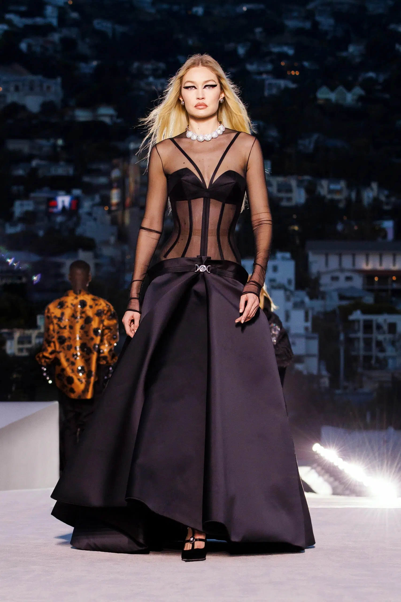

Train a model to predict the brand of an image.Let's start from 2 brands.\

Usefull tips:
1. The photo background is fine
2. The size of the each immages has to be the same (line 256*256)
3. Train size: 90% of total number of immges
4. Test size: 10% of total number of immges

## Steps:
1. Prepare the photos: 
- Idea 1: Find the person on each images and crop the photo 
- idea 2: Find the center of the images and crop the photo
2. Create Train and Test the model 
- TBD: Which models?
3. Predict the brand
4. Visualize the results

[//]:#

## Disertation sections:
1. Introduction
- why its import to identify the brand?
- How ML can help?
2. * **FIND A NAME OF THIS SECTIONS** /!\
- Intro to interpretability issues
- Model proposal
  - State of art
  - how its work 
  - the model architecture
- ETL of the data
- Training of the model
- Testing of the model
- Visualize the results:
  - What kind of value we can get from the model
- General conclusion

